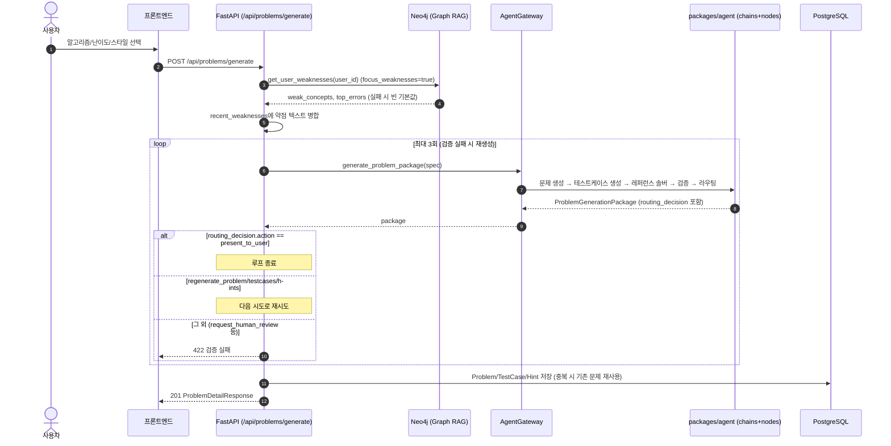
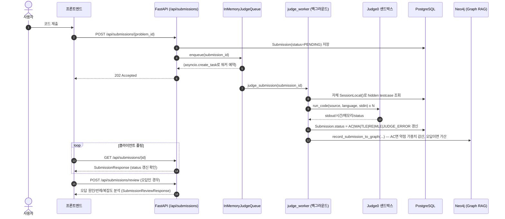
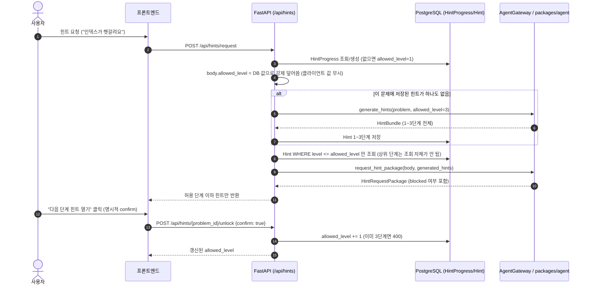
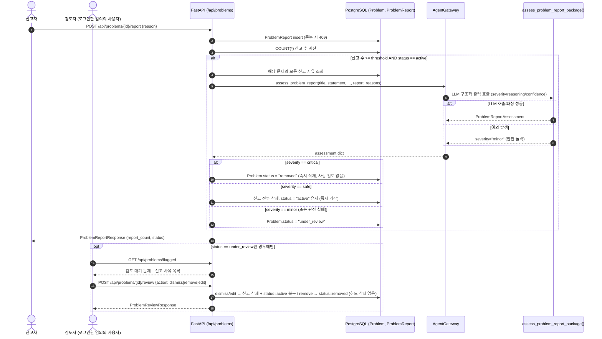

# API Reference

`apps/api`(FastAPI)가 실제로 노출하는 REST API 전체 레퍼런스다. 코드 기준(라우터: `apps/api/app/routers/*.py`)으로
작성되었으며, 스키마 필드 하나하나까지 코드와 대조해 검증했다. 요청/응답 필드 상세는
`apps/api/app/schemas/*.py`를 참조한다.

- 모든 엔드포인트는 `GET /health`를 제외하고 `Authorization: Bearer <JWT>` 인증이 필요하다
  (`Depends(get_current_user_id)`).
- 별도의 관리자(admin) 역할은 존재하지 않는다 — 로그인한 사용자는 모두 동일한 권한을 갖는다
  (문제 관리/HITL 검토 포함).
- Base URL은 개발 환경 기준 `http://localhost:10000`.

---

## 목차

1. [인증 (`/api/auth`)](#1-인증-apiauth)
2. [문제 (`/api/problems`)](#2-문제-apiproblems)
3. [제출/채점 (`/api/submissions`)](#3-제출채점-apisubmissions)
4. [힌트 (`/api/hints`)](#4-힌트-apihints)
5. [커뮤니티 (`/api/community`)](#5-커뮤니티-apicommunity)
6. [시퀀스 다이어그램](#6-시퀀스-다이어그램)

---

## 1. 인증 (`/api/auth`)

| Method | Path | 설명 |
|---|---|---|
| POST | `/api/auth/register` | 회원가입. 이메일 중복 시 409. 성공 시 JWT 발급 (201) |
| POST | `/api/auth/login` | 로그인. 이메일/비밀번호 불일치 시 401 |
| GET | `/api/auth/me` | 현재 로그인 사용자 정보 |
| DELETE | `/api/auth/me` | 계정 및 개인 데이터 삭제 (FR-28, 204) |
| GET | `/api/auth/weaknesses` | Neo4j Graph RAG 기반 취약점 진단 + 추천 코멘트 조회 |

**POST /api/auth/register**
```jsonc
// Request
{ "email": "user@example.com", "password": "최소8자", "display_name": "선택" }
// Response 201
{ "access_token": "<JWT>", "token_type": "bearer" }
```

**GET /api/auth/weaknesses** — 응답 (`packages/graphrag/query.py::get_user_weaknesses`)
```jsonc
{
  "weak_concepts": [{ "concept": "bfs", "score": 4.5 }],
  "top_errors": [{ "error_type": "WA", "count": 3 }],
  "recommendation": "AI 분석 결과, ... (한국어 추천 문구)"
}
```
Neo4j 연결이 불가능하면 예외를 삼키고 빈 기본값(`weak_concepts: []`, 안내 문구)으로 폴백한다.

---

## 2. 문제 (`/api/problems`)

| Method | Path | 설명 |
|---|---|---|
| POST | `/api/problems/generate` | 새 문제 생성 (검증 실패 시 최대 3회 자동 재생성) |
| GET | `/api/problems` | 문제 목록 (공개 카탈로그 또는 내 문제) — 필터/정렬 지원 |
| GET | `/api/problems/flagged` | 검토 대기(`under_review`) 문제 목록 — **`/{problem_id}`보다 먼저 등록되어야 라우팅이 올바름** |
| GET | `/api/problems/{problem_id}` | 문제 상세 (`reference_solution` 제외) |
| POST | `/api/problems/{problem_id}/reveal-solution` | 정답 코드 열람 (명시적 `confirm=true` 필수, FR-20) |
| POST | `/api/problems/{problem_id}/report` | 문제 신고 (임계치 초과 시 Agent 사전 심사 트리거) |
| DELETE | `/api/problems/{problem_id}/report` | 내 신고 취소 |
| GET | `/api/problems/{problem_id}/report` | 신고 상태 조회 (신고/취소 토글 UI용) |
| POST | `/api/problems/{problem_id}/review` | HITL 조치: dismiss / remove / edit |

### POST /api/problems/generate
```jsonc
// Request (ProblemGenerateRequest)
{
  "algorithm": "binary_search",
  "difficulty": "medium",              // easy | medium | hard
  "problem_style": "practical",
  "language": "Python",
  "learning_goal": "파라메트릭 서치 연습",
  "user_level": "중급",
  "recent_weaknesses": [],             // focus_weaknesses=true면 Neo4j 조회 결과가 자동 추가됨
  "min_cases": 5,
  "allowed_hint_level": 3,
  "include_hints": true,
  "seed": null,                        // 미지정 시 서버가 UUID 발급 (variant 다양성 확보)
  "force_new": false,
  "focus_weaknesses": true
}
// Response 201 (ProblemDetailResponse) — reference_solution 미포함
{
  "id": "binary_search_budget_cap",
  "title": "예산 상한액 찾기",
  "difficulty": "medium",
  "algorithm": ["binary_search"],
  "statement": "...", "input_format": "...", "output_format": "...",
  "constraints": ["..."], "sample_input": "...", "sample_output": "...",
  "expected_time_complexity": "O(N log(max))",
  "status": "active",
  "generation_mode": "deterministic", "seed": "…", "variant_id": "budget_cap",
  "created_by_name": "user@example.com", "created_at": "2026-07-08T00:00:00Z"
}
```
검증 실패 시 라우팅 결정(`routing_decision.action`)이 `regenerate_*` 계열이면 최대 3회까지
자동 재생성하고, 그래도 실패하면 `422`를 반환한다. 성공한 문제/테스트케이스/힌트는 DB에 저장되고,
같은 제목+본문의 문제가 이미 있으면 (force_new=false 기준) 기존 문제를 재사용한다.

### GET /api/problems
쿼리 파라미터: `mine`(bool, 기본 false) · `algorithm` · `difficulty` · `q`(제목/본문 검색) ·
`sort`(`recent`|`difficulty`) · `skip` · `limit`.
- `mine=false`(기본): `Problem.status == "active"`인 전체 공개 문제만 (신고로 `under_review`/`removed`된
  문제는 숨겨짐)
- `mine=true`: 본인이 생성한 문제 전체 (상태 무관)

### POST /api/problems/{problem_id}/report — 신고 + Agent 사전 심사 (FR-34/35)
```jsonc
// Request
{ "reason": "예제 출력이 문제 설명과 맞지 않습니다." }
// Response 201 (ProblemReportResponse)
{ "id": 12, "problem_id": "...", "reason": "...", "created_at": "...",
  "report_count": 5, "status": "under_review" }
```
같은 사용자가 같은 문제를 다시 신고하면 `409`. 누적 신고 수(`COUNT(*)`)가
`settings.problem_report_threshold`(기본 5) 이상이 되는 순간, 응답이 나가기 전에 서버가
`assess_problem_report_package()`를 호출해 즉시 분기한다 (상세 시퀀스는 6장 참조):
- `critical` → `status="removed"` (즉시 삭제, 사람 검토 없음)
- `safe` → 신고 전부 삭제, `status="active"` 유지 (즉시 기각, 사람 검토 없음)
- `minor`/판정 실패 → `status="under_review"` (사람 검토 대기)

### GET /api/problems/flagged / POST /api/problems/{id}/review
- `flagged`: `under_review` 문제 목록 + 각 문제의 신고 사유(`reports[]`) 전체를 반환한다.
- `review` 요청 바디(`ProblemReviewRequest`): `action`(`dismiss`|`remove`|`edit`) +
  edit일 때만 `title`/`statement`/`difficulty`/`constraints`/`sample_input`/`sample_output`(선택).
  `dismiss`/`edit`은 신고를 지우고 `active`로 복구, `remove`는 소프트 삭제(`status="removed"`) —
  어느 쪽도 실제 row를 hard delete하지 않는다 (Submission/SharedSolution 이력 보존).

---

## 3. 제출/채점 (`/api/submissions`)

| Method | Path | 설명 |
|---|---|---|
| POST | `/api/submissions/{problem_id}` | 코드 제출 → 채점 큐 등록, 즉시 202 |
| GET | `/api/submissions/{submission_id}` | 채점 결과 폴링 (본인 제출만) |
| GET | `/api/submissions/problem/{problem_id}` | 특정 문제의 내 제출 이력 (최근 20개) |
| POST | `/api/submissions/review` | 채점 결과에 대한 Agent 리뷰(오답 분석/반례/복잡도) 생성 |

### POST /api/submissions/{problem_id}
```jsonc
// Request
{ "code": "print(1)", "language": "python" }
// Response 202 (SubmissionResponse)
{ "id": 101, "problem_id": "...", "language": "python", "status": "PENDING",
  "runtime_ms": null, "memory_kb": null, "created_at": "..." }
```
내부적으로 `Submission(status="PENDING")`을 저장하고 `JudgeQueue.enqueue(submission_id)`를
호출한 뒤 즉시 응답한다. 실제 채점은 `apps/api/app/judge_worker.py`가 백그라운드에서 수행하며,
Judge0 실행 결과에 따라 `status`를 `AC`/`WA`/`TLE`/`RE`/`MLE`/`JUDGE_ERROR` 중 하나로 갱신한다.
클라이언트는 `GET /api/submissions/{id}`를 폴링해 상태 변화를 확인한다.

### POST /api/submissions/review
채점이 끝난 뒤(WA/TLE/RE/MLE 등) 프론트가 호출해 오답 분석/반례/복잡도 분석을 받는 엔드포인트.
`packages/agent`의 `review_submission_package()`를 호출하며, Judge0를 다시 실행하지 않고 이미
채점된 결과(`result_type`, `failed_testcase_name`, `expected_output`, `actual_output`, `stderr` 등)만
가지고 결정론적으로 분석한다. 응답은 `SubmissionReviewResponse`(`evaluation_report`,
`error_diagnosis`, `failed_case_explanation`, `complexity_analysis`, `counterexample_report`,
`feedback_report`, `routing_decision`, `concept_context`)이며, 정답 코드는 포함되지 않는다.

---

## 4. 힌트 (`/api/hints`)

| Method | Path | 설명 |
|---|---|---|
| POST | `/api/hints/request` | 챗봇형 힌트 요청 (허용 단계 이하만 반환) |
| GET | `/api/hints/{problem_id}/progress` | 현재 허용 힌트 단계 조회 |
| GET | `/api/hints/{problem_id}` | 허용 단계 이하 힌트 전체 조회 |
| POST | `/api/hints/{problem_id}/unlock` | 다음 단계로 승급 (명시적 confirm 필수) |

### POST /api/hints/request
```jsonc
// Request (HintRequestPackageInput) — allowed_level은 서버가 DB 값으로 강제 덮어씀
{ "problem_id": "...", "query": "인덱스 조절에서 무한루프가 발생해요",
  "requested_level": 2, "user_situation": "..." , "include_sources": true }
```
서버는 클라이언트가 보낸 `allowed_level`을 무시하고 `HintProgress.allowed_level`(DB)로 항상
덮어쓴다 — 클라이언트가 임의로 상위 단계를 요청할 수 없다 (NFR-4). 해당 문제에 저장된 힌트가
하나도 없으면 그 자리에서 Agent로 1~3단계를 모두 생성해 DB에 저장한 뒤, 그중 허용 단계 이하만
조회해 응답한다 (`HintRequestPackage` — `blocked`/`block_reason` 필드로 초과 요청 여부를 알려줌).

### POST /api/hints/{problem_id}/unlock
```jsonc
// Request
{ "confirm": true }
// Response (HintProgressResponse)
{ "problem_id": "...", "allowed_level": 2 }
```
`confirm=false`거나 이미 3단계면 각각 400을 반환한다. 승급은 항상 +1씩만 가능하다 (FR-17).

---

## 5. 커뮤니티 (`/api/community`)

| Method | Path | 설명 |
|---|---|---|
| POST | `/api/community/share` | AC 제출을 공개 풀이로 공유 |
| GET | `/api/community/{problem_id}` | 문제별 공유 풀이 목록 (AC gating 적용) |
| POST | `/api/community/{shared_solution_id}/like` | 좋아요 토글 |
| POST | `/api/community/{shared_solution_id}/comments` | 댓글 작성 |
| GET | `/api/community/{shared_solution_id}/comments` | 댓글 목록 |

**gating 규칙 (FR-30)**: `share`를 제외한 모든 조회/좋아요/댓글 엔드포인트는 호출자가 해당
`problem_id`를 스스로 AC한 기록(`SolvedRecord`)이 없으면 `403`을 반환한다
(`_assert_solved()`). `share`는 AC된 본인 제출(`Submission.status == "AC"`)만 공유할 수 있고,
같은 제출을 두 번 공유하면 `409`다.

---

## 6. 시퀀스 다이어그램

### 6.1 문제 생성 (검증 실패 시 재생성 루프 포함)



### 6.2 코드 제출 및 채점 (인메모리 큐)



### 6.3 챗봇형 힌트 요청/승급 (단계 게이트)



### 6.4 문제 신고 → 임계치 도달 → Agent 사전 심사 → (필요 시) 사람 검토

이 흐름은 `docs/ARCHITECTURE.md` 7장에서 설명하는 실제 구현이다. 별도 관리자 역할이나
LangGraph Interrupt/체크포인터 재개 없이, 신고 요청-응답 한 번 안에서 판정과 상태 전이가
동기적으로 끝난다.


