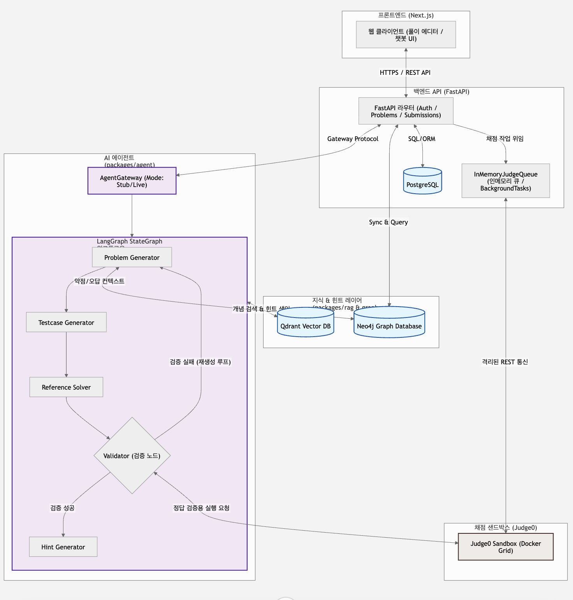
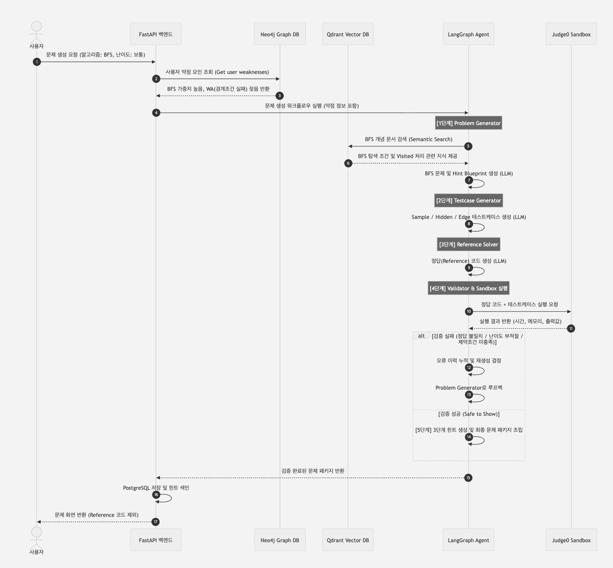
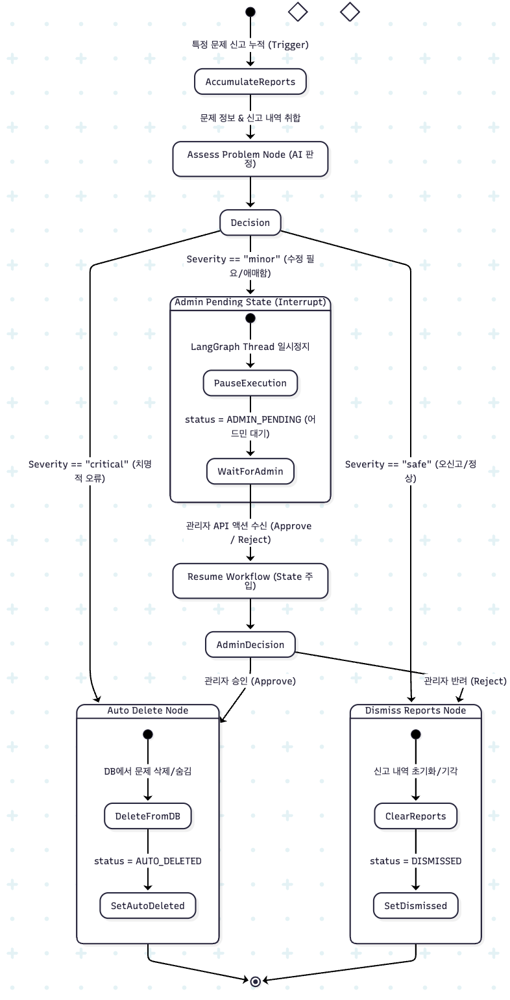
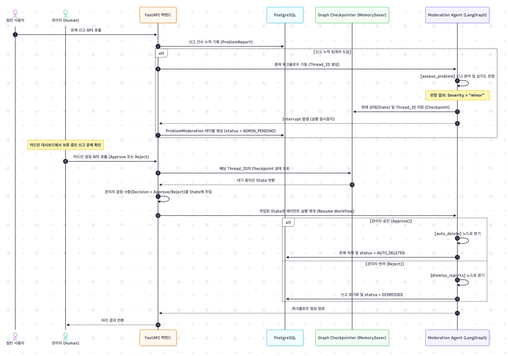

# 아키텍처 (Architecture)

CodeMaker Coach Agent의 시스템 아키텍처를 정의한다.
채점은 **Judge0(기존 오픈소스)** 를 사용하며, 직접 샌드박스를 구현하지 않는다.
채점 작업 큐는 **MVP 단계에서 인메모리 큐**를 사용한다. (아래 2.6 참조)

---

## 1. 컴포넌트 개요

```
[사용자 브라우저 / Next.js]
  │  문제 생성 요청 / 코드 제출 / 힌트 챗봇 / 커뮤니티 조회
  ▼
[API 서버 / FastAPI]──────────────┬───────────────┬────────────────┐
  │                               │               │                │
  ▼ (동기: 생성·힌트·피드백)       ▼ (비동기: 채점) ▼                ▼
[Agent 코어 / packages/agent] [인메모리 큐]     [PostgreSQL]     [Neo4j]
  ├─ Problem Generator       (백그라운드 워커) 유저·문제·힌트    (Graph RAG:
  ├─ Testcase Generator          │            제출·공유코드      약점 개인화)
  ├─ Reference Solver            ▼            ·힌트단계상태
  ├─ Validator              [Judge0]
  └─ Feedback/Hints         Docker sandbox
  │                         (timeout·mem·net 차단)
  ▼                              │
[RAG / Vector DB]                ▼
 Qdrant/pgvector            [채점 결과 AC/WA/TLE/RE]
  ├─ 개념 문서 색인               └─> 콜백 → 상태 분기 → 학습 로그 저장
  └─ 힌트 색인(문제별)
```

---

## 2. 레이어별 책임

### 2.1 프론트엔드 (`apps/web`, Next.js)
- **문제 생성 화면** (`/generate`): 알고리즘·난이도·스타일·언어·힌트 방식 선택
- **문제 풀이 화면** (`/solve/[id]`): 문제 + Monaco/CodeMirror 에디터 + 실행/제출 + **AI Tutor 챗봇 패널**
- **커뮤니티** (`/community`): 코드 공유 피드 (gating 적용)
- 힌트 단계·정답 노출 여부는 프론트에서 임의로 못 바꾼다 → 서버가 판단 (NFR-4)

### 2.2 API 서버 (`apps/api`, FastAPI)
- 라우터: `problems`, `submissions`, `hints`, `community`, `auth`
- Agent 코어를 `AgentGateway` 프로토콜(`app/gateway.py`)을 통해 **import해서 호출**한다.
  `LiveAgentGateway`는 `packages/agent`의 서비스 함수(`generate_problem_package`,
  `request_hint_package`, `review_submission_package`, `assess_problem_report_package`)를
  호출하고, `StubAgentGateway`는 결정론적 더미 응답을 반환한다. 어느 쪽을 쓸지는
  `AGENT_MODE` env(`stub`/`live`/`auto`)로 결정한다.
- 채점은 직접 안 하고 **큐에 적재** 후 즉시 응답(202) → 결과는 폴링
- **힌트 단계 게이트키핑**을 여기서 강제한다 (허용 단계 이하만 Agent에 전달)

### 2.3 Agent 코어 (`packages/agent`)
- 웹/DB에 의존하지 않는 **독립 패키지** (NFR-10)
- **LangGraph `StateGraph`가 아니다** — `packages/agent/nodes/`의 각 Node 함수를
  `packages/agent/nodes/workflow.py`의 러너(`run_package_workflow`,
  `run_submission_review_workflow` 등)가 순서대로 호출하는 **결정론적 파이프라인**이다.
  조건 분기(재생성/라우팅)는 Python 조건문으로 구현되며, LLM 호출은
  `packages/agent/chains/`의 LangChain 체인이 담당한다. 상세 구조는
  `docs/AGENTS_AND_TOOLS.md` 참조.
- Tool은 `packages/agent/tools/`에 정의, 외부 자원(Judge0·RAG·DB)은 주입받는다

### 2.4 RAG (`packages/rag`)
- `docs/knowledge/`의 개념 문서를 Loader→Splitter→Embed→VectorStore→Retriever로 색인
- **두 개의 검색 대상**을 가진다:
  1. **개념 문서 색인** — 문제 생성·오답 분석 근거
  2. **힌트 색인** — 문제 생성 시 저장된 힌트를 문제별로 검색 (단계 필터 적용)

### 2.5 Graph RAG (`packages/graphrag`, Neo4j)
- 사용자 약점·문제·개념·오답유형 관계를 Neo4j에 그래프 구조로 유지하고 개인화 문제 생성에 활용한다.
- **오답 발생/해결 시점**: `judge_submission` 완료 시점에 사용자-개념 간의 약점 가중치(`WEAK_IN {weight_score}`)를 증감하여 학습 상태를 누적 업데이트한다.
- **문제 생성 시점**: 생성 에이전트 구동 전 Neo4j에서 현재 사용자의 약점 개념(가중치가 높은 알고리즘 태그)과 잦은 오답 유형을 조회한 뒤, `recent_weaknesses` 프롬프트 필드에 주입하여 LLM이 개인화된 맞춤 문제를 설계하도록 유도한다.

### 2.6 채점 작업 큐 (MVP: 인메모리)
- **MVP는 인메모리 큐를 사용한다.** 사용자 규모가 작아 별도 브로커(Redis)와 Celery 워커가 불필요하다.
  - 구현: FastAPI `BackgroundTasks` 또는 `asyncio.Queue` + 인프로세스 백그라운드 워커
  - 장점: 추가 컨테이너/워커 프로세스 없음, 설정 단순, 자원 소모 미미
  - 한계(인지하고 감수): 프로세스 재시작 시 대기 작업 유실, 멀티 API 워커로 수평 확장 불가, 작업 영속성 없음
- **큐는 인터페이스로 추상화한다** (`enqueue_judge(...)` / 워커). 구현체만 인메모리 → Redis+Celery/RQ로
  교체할 수 있게 설계해, 트래픽 증가 시 **Agent·API 로직 변경 없이** 전환한다.
- 전환 트리거(참고): 다중 인스턴스 배포가 필요해지거나, 재시작 시 작업 유실이 문제가 될 때.

### 2.7 채점 (Judge0, `infra/docker-compose.yml`)
- 기존 오픈소스. REST API로 `언어 + 코드 + stdin` 전달 → `stdout/시간/메모리/상태` 반환
- `packages/agent/tools/run_user_code.py`가 얇은 클라이언트
- API·DB와 네트워크 격리, timeout·memory·network 차단

---

## 3. 데이터 흐름 (핵심 시나리오)

### 3.1 문제 생성 (동기)
```
사용자 선택 → API → Neo4j 약점 및 오답 유형 쿼리 → 약점 주입
  → RAG(개념 검색) → Problem Generator → Testcase Generator
  → Reference Solver → Validator
      ├ 실패 → 재생성 (분기)
      └ 성공 → 문제 + 힌트(1~3단계) DB 저장 + 힌트 벡터 색인 → 사용자에게 문제 제공
```

### 3.2 채점 (비동기, 인메모리 큐)
```
코드 제출 → API가 인메모리 큐에 적재 → 202 응답
  → 백그라운드 워커가 Judge0로 hidden testcase 실행 → 상태(AC/WA/TLE/RE/MLE)
  → 콜백 → LangGraph 분기(정답 로그 / 오답 분석 / 복잡도 분석 / 에러 분석)
      ├ 정답(AC) -> Neo4j 약점 가중치 감산 및 해결 이력 기록
      └ 오답(WA/TLE/RE) -> Neo4j 약점 가중치 가산 및 오답 유형 축적
  → 사용자에게 결과 전달 (폴링/WebSocket)
```

### 3.3 힌트 (챗봇, 동기) — 단계 제어 핵심
```
사용자가 챗봇에 힌트 요청
  → API가 (user, problem)의 "현재 허용 단계" 조회 (DB)
  → RAG 힌트 검색 범위를 [1 .. 허용단계]로 제한   ← 상위 단계는 물리적으로 검색 불가
  → Feedback/Hints Agent가 검색된 힌트로 응답 구성 (구조까지만, 핵심 코드 제외)
  → 다음 단계 요청 시 → 승급 확인 → 허용 단계 +1
```
> 상위 단계 힌트는 "프롬프트에 안 넣는" 수준이 아니라 **검색 대상에서 제외**되어야 안전하다. (NFR-4)

---

## 4. 노드 파이프라인 워크플로우 (기획 12.2, 결정론적 Node 체인 — LangGraph 아님)

```
[사용자 선택]
   ↓
[Problem Generator] → [Testcase Generator] → [Reference Solver] → [Validator]
   ↓ (조건 분기)
   ├ 검증 실패 → 문제 재생성
   └ 검증 성공 → 문제 + 힌트 저장 → 제공
        ↓
   [사용자 코드 제출] → [Code Execution (Judge0)]
        ↓ (조건 분기)
        ├ 정답      → 학습 로그 저장 & Neo4j 가중치 해결 반영
        ├ 오답      → 오답 분석 + 반례 생성 & Neo4j 취약점 추가
        ├ 시간 초과 → 시간복잡도 분석
        └ 런타임 E  → 에러 분석
        ↓
   [Feedback / Hints Generator]  (힌트 단계·노출 범위 정책 적용)
```

---

## 5. 데이터 모델 (PostgreSQL, 주요 테이블)

```
User            : id, email, password_hash, created_at
Problem         : id, title, difficulty, algorithm[], statement, input_format,
                  output_format, constraints[], sample_input, sample_output,
                  reference_solution(비공개), time_complexity, created_by, created_at,
                  status(active|under_review|removed) ← 7장 HITL 상태
TestCase        : id, problem_id, type(sample|hidden|edge), input, expected_output
Hint            : id, problem_id, level(1|2|3), content,
                  reveals_core_code(false 강제), code_skeleton(nullable)
Submission      : id, user_id, problem_id, code, language,
                  status(AC|WA|TLE|RE|MLE|JUDGE_ERROR), runtime, memory, created_at
HintProgress    : user_id, problem_id, allowed_level   ← 힌트 단계 게이트 상태
SolvedRecord    : user_id, problem_id, solved_at        ← 공유 gating 판단용
LearningLog     : id, user_id, problem_id, error_type, hint_level_used, resolved
SharedSolution  : id, submission_id, title, description, is_public, likes_count, created_at
Comment         : id, shared_solution_id, user_id, content, created_at
Like            : user_id, shared_solution_id
ProblemReport   : id, user_id, problem_id, reason, created_at
                  (user_id+problem_id UNIQUE ← 중복 신고 방지, 신고 수는 COUNT(*)로 계산)
```

핵심 제약:
- `Hint.reveals_core_code`는 항상 false (저장 전 필터 검증) — 요구사항 FR-19
- `HintProgress.allowed_level`로 힌트 초과 요청 차단 — FR-18
- `SolvedRecord` 존재 여부로 커뮤니티 공유 코드 gating — FR-30

---

## 6. 인프라 (`infra/docker-compose.yml`)

| 컨테이너 | 역할 | MVP 필수 |
|---|---|:---:|
| `postgres` | 관계형 데이터 | ✅ |
| `qdrant` | 벡터 스토어 (개념 + 힌트 색인) | ✅ |
| `judge0` | 코드 채점 샌드박스 (+ 부속 워커/DB) | ✅ |
| `api` | FastAPI (인메모리 큐 + 백그라운드 워커 포함) | ✅ |
| `web` | Next.js | ✅ |
| `neo4j` | Graph RAG (개인화 확장) | ✅ (Phase 4 도입) |
| ~~`redis`~~ | ~~채점 큐 브로커~~ → **MVP 제외**, 인메모리 큐로 대체 (트래픽 증가 시 도입) | ⬜ |

> - 채점 큐는 MVP에서 API 프로세스 내부 인메모리 큐(`apps/api/app/queue.py`)로 처리하므로 별도 컨테이너가 없다. (2.6 참조)
> - `judge0-redis`는 Judge0 자체 구현이 쓰는 내부 컴포넌트다. "앱 큐용 Redis"와 혼동하지 않는다 — 위 표의 `~~redis~~` 행이 가리키는 것은 앱 큐용이며 MVP에서 실제로 존재하지 않는다.
> - Judge0는 API·DB 네트워크와 분리된 네트워크에 두어 격리한다. (NFR-2)

---

## 7. 신고 누적 문제 자동 중재 (Human-in-the-Loop, FR-34/FR-35, 구현 완료)

특정 문제의 신고가 임계치 이상 누적되면, 사람이 검토하기 전에 Agent가 먼저 문제와 신고 사유를
재검증해 심각도를 판정한다. **아래는 실제로 구현되어 `develop`에 병합된 사양이며, 별도의
어드민 역할이나 LangGraph Interrupt/체크포인터를 쓰지 않는 단순한 설계**로 만들어졌다
(8.2의 이미지는 검토 초안 당시의 설계로, 실제 구현과 다른 부분이 있다 — 8.2 하단 참고).

### 7.1 상태 모델 (기존 테이블 재사용, 별도 테이블 없음)
- 별도의 `ProblemModeration` 테이블을 두지 않는다. 기존 `Problem.status` 컬럼
  (`active` | `under_review` | `removed`)과 기존 `ProblemReport` 테이블(신고 1건 = 1 row,
  `user_id`+`problem_id` unique)만으로 상태를 표현한다.
- 신고 누적 수는 별도 카운터 컬럼이 아니라 `ProblemReport`에 대한 `COUNT(*)`로 즉시 계산한다
  (`_report_count()`, `apps/api/app/routers/problems.py`).

### 7.2 판정 흐름 (LangGraph Interrupt 없음 — 요청-응답 내에서 동기적으로 완결)
`POST /api/problems/{id}/report` 한 번의 요청 안에서 아래가 순서대로 일어난다. 별도 스레드/재개
없이 API 응답이 돌아가기 전에 모두 끝난다.

1. 신고를 `ProblemReport`에 저장한다 (같은 사용자의 중복 신고는 409로 거부).
2. 누적 신고 수(`COUNT(*)`)가 `settings.problem_report_threshold`(기본 5) 이상이고 문제가 아직
   `active`이면, 그 문제의 모든 신고 사유와 문제 본문을 묶어
   `packages/agent`의 `assess_problem_report_package()`를 호출한다. 이 함수는 LLM을
   `ProblemReportAssessment`(`severity: critical|safe|minor`, `reasoning`, `confidence`) 구조화
   출력으로 호출하고, **LLM 호출/파싱이 실패하면 예외를 삼키고 항상 `severity="minor"`로
   폴백**한다 (오탐으로 인한 자동 삭제·자동 기각을 막기 위한 안전장치).
3. 판정 결과에 따라 즉시 분기한다 (Interrupt/재개 없음):
   - `critical` → 사람 검토 없이 즉시 `Problem.status = "removed"` (소프트 삭제).
   - `safe` → 사람 검토 없이 해당 문제의 `ProblemReport`를 전부 삭제하고 `status = "active"` 유지(오신고 기각).
   - `minor` (또는 판정 실패 폴백) → 기존과 동일하게 `status = "under_review"`로 전환해 사람 검토 대기열에 올린다.

### 7.3 사람 검토 (Human-in-the-Loop) — 어드민 계정 없음
- `under_review` 상태의 문제는 공개 카탈로그(`GET /api/problems`, `mine=false`)에서 자동으로
  숨겨진다 (`Problem.status == "active"` 필터).
- **별도의 관리자(admin) 역할은 존재하지 않는다.** `GET /api/problems/flagged`(검토 대기 목록 조회)와
  `POST /api/problems/{id}/review`(조치)는 로그인한 사용자라면 누구나 호출할 수 있다 — 이는 애초
  admin-only로 만들었다가, "문제 관리 페이지는 별도 관리자 없이 모든 로그인 사용자가 접근 가능해야
  한다"는 명시적 결정에 따라 바뀐 것이다.
- 조치(`action`)는 3가지: `dismiss`(신고 기각, active로 복구) / `remove`(소프트 삭제, `status=removed`)
  / `edit`(제목·본문 등 수정 후 active로 복구). 세 경우 모두 실제 행(row) 삭제(hard delete)는 절대
  하지 않는다 — `Submission`/`SharedSolution` 등 관련 레코드가 `ON DELETE CASCADE`라 하드 삭제 시
  사용자들의 기존 제출/학습 이력까지 함께 사라지기 때문이다.

> 시퀀스 다이어그램은 `docs/API_REFERENCE.md`의 "문제 신고 / HITL 흐름" 섹션 참조.

---

## 8. 시각화 아키텍처 다이어그램 (Images)

### 8.1 전체 시스템 구조 & 흐름
* **전체 시스템 구성도**
  
* **전체 시퀀스 다이어그램**
  

### 8.2 신고 중재(Moderation) 이미지 — 설계 초안(참고용, 실제 구현과 다름)
* 
* 

> **주의**: 위 두 이미지는 `ProblemModeration` 테이블, LangGraph `Interrupt`/`MemorySaver` 기반
> 일시정지·재개, 어드민 전용 `POST /api/admin/moderations/{id}/action` API를 전제로 한 **초기 설계
> 스케치**다. 실제 구현(7장)은 이보다 단순하다 — 기존 `Problem.status`/`ProblemReport` 테이블만
> 재사용하고, Interrupt 없이 요청-응답 안에서 동기적으로 판정·분기가 끝나며, 어드민 역할 없이 모든
> 로그인 사용자가 검토에 참여한다. 최신 Mermaid 시퀀스 다이어그램은 `docs/API_REFERENCE.md`를 참조한다.
