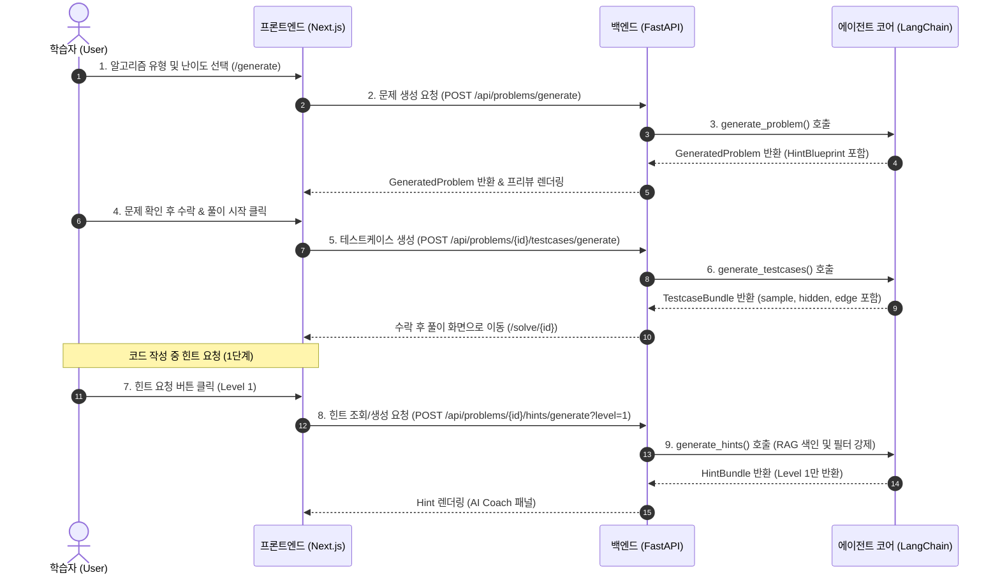

# MVP Interface Design Document (인터페이스 설계서)

본 문서는 **CodeMaker Coach Agent**의 MVP(Minimum Viable Product) 단계에서 구현된 AI 생성 레이어(`packages/agent`) 및 RAG 레이어(`packages/rag`)를 외부 API 서비스 및 웹 프론트엔드 인터페이스에 결합하기 위한 사양을 정의합니다.

---

## 1. MVP 사용자 흐름 (User Flow)



---

## 2. 화면 인터페이스 설계 (Screen Design)

### 2.1 문제 생성 및 미리보기 화면 (`/generate`)
사용자가 코딩테스트의 조건(알고리즘 유형, 난이도, 학습 목표 등)을 지정하고 문제를 생성하는 단계입니다.
- **입력 폼 영역**:
  - **알고리즘 유형(Select Box)**: `이분 탐색`, `BFS`, `DFS`, `그리디`, `해시`, `투 포인터` 등
  - **난이도(Radio Button)**: `쉬움`, `보통`, `어려움`
  - **프로그래밍 언어(Select Box)**: `Python`, `Java`, `C++`
  - **학습 목표(Input Text)**: 예) `매개 변수 탐색과 경계값 처리`
  - **최근 취약점(Checkbox Group)**: 이전 학습 로그에서 추천된 취약 키워드 목록
- **문제 미리보기 영역 (Preview Container)**:
  - **제목 & 난이도 배지**: 난이도에 따른 시각적 태그 표시
  - **문제 본문 (Markdown Renderer)**: 생성된 문제 설명문
  - **입출력 형식 및 제한 조건**: $N$의 범위, 시간/메모리 제한 명시
  - **풀이 시작 버튼**: 클릭 시 `/solve/[id]` 화면으로 이동하며 백그라운드에서 테스트케이스가 생성/로드됨

### 2.2 문제 풀이 및 AI 코치 화면 (`/solve/[id]`)
실제 에디터를 보며 코딩을 수행하고, 막힐 때 단계별로 AI 코칭을 받는 화면입니다.
- **좌측 패널 - 문제 명세서**:
  - 생성된 문제 본문, 입출력 포맷, 제약 조건
  - 예제 입력 및 예제 출력 리스트
- **우측 패널 - Monaco/CodeMirror 에디터**:
  - 사용자가 선택한 언어의 문법 하이라이팅이 적용된 코드 입력 영역
  - 실행 및 제출 버튼
- **슬라이드 아웃 / 하단 패널 - AI Coach 힌트 창**:
  - **현재 힌트 단계 표시기**: `Level 1` -> `Level 2` -> `Level 3` 표시기
  - **힌트 말풍선**: 사용자가 명시적으로 "다음 단계 힌트 열기"를 클릭할 때에만 순차적으로 해제됨
  - **구조/스켈레톤 뷰어**: Level 3 도달 시 빈칸이 뚫려 있는 부분 코드 블록 노출

---

## 3. 백엔드 API 명세 (API Draft)

백엔드 `apps/api`는 `packages/agent` 패키지를 가져와 호출하며, 아래의 엔드포인트를 노출합니다.

### 3.1 문제 생성 API
*   **Method**: `POST`
*   **Path**: `/api/problems/generate`
*   **Request Body**: `ProblemGenerationInput`
*   **Response Body**: `GeneratedProblem`

### 3.2 테스트케이스 생성 API
*   **Method**: `POST`
*   **Path**: `/api/problems/{problem_id}/testcases/generate`
*   **Request Body**: `{ min_cases: int }`
*   **Response Body**: `TestcaseBundle`

### 3.3 힌트 생성 및 RAG 조회 API
*   **Method**: `POST`
*   **Path**: `/api/problems/{problem_id}/hints/generate`
*   **Request Query**: `?allowed_level=1` (1~3 단계 제어)
*   **Response Body**: `HintBundle` (allowed_level 이하의 힌트만 담김)

---

## 4. 입출력 JSON 예시 (Schema Mapping)

### 4.1 ProblemGenerationInput (Request)
```json
{
  "algorithm": "binary_search",
  "difficulty": "medium",
  "problem_style": "practical",
  "language": "Python",
  "learning_goal": "parametric search and boundary handling",
  "user_level": "intermediate",
  "recent_weaknesses": ["off-by-one indices", "while loop condition bounds"]
}
```

### 4.2 GeneratedProblem (Response)
```json
{
  "problem_id": "binary_search_budget_allocation",
  "title": "Budget Allocation Optimization",
  "difficulty": "medium",
  "algorithm": ["binary_search"],
  "learning_goal": "parametric search and boundary handling",
  "statement": "You are tasked with allocating a budget...",
  "input_format": "The first line contains N...",
  "output_format": "Output a single integer...",
  "constraints": ["1 <= N <= 100,000", "1 <= budget <= 10^9"],
  "sample_input": "4 10\n1 2 3 4",
  "sample_output": "3",
  "expected_time_complexity": "O(N log(max(project_costs)))",
  "hint_blueprint": {
    "intended_algorithm": ["binary_search"],
    "core_insight": "Optimize the maximum allocation amount directly...",
    "common_misconceptions": ["Using simple greedy without sorting"],
    "edge_case_focus": ["Budget less than minimum cost"],
    "forbidden_disclosures": ["Providing the complete bin_search loop"],
    "level_1_guidance": "Try to determine if a specific limit is possible or not...",
    "level_2_guidance": "Use binary search on the search space of budget values...",
    "level_3_guidance": "Implement a check(mid) function to verify if N values fit in the budget.",
    "allowed_code_exposure": "skeleton_only"
  }
}
```

### 4.3 TestcaseBundle (Response)
```json
{
  "problem_id": "binary_search_budget_allocation",
  "testcases": [
    {
      "name": "Sample Testcase 1",
      "input_data": "4 10\n1 2 3 4",
      "expected_output": "3",
      "visibility": "sample",
      "purpose": "Verify basic example works"
    },
    {
      "name": "Edge Testcase 1",
      "input_data": "1 10\n10",
      "expected_output": "10",
      "visibility": "edge",
      "purpose": "Boundary check with single element"
    }
  ],
  "generation_notes": "Generated sample and edge cases properly."
}
```

### 4.4 HintBundle (Response)
```json
{
  "problem_id": "binary_search_budget_allocation",
  "blueprint": {
    "intended_algorithm": ["binary_search"],
    "core_insight": "Optimize the maximum allocation amount directly...",
    "common_misconceptions": [],
    "edge_case_focus": [],
    "forbidden_disclosures": [],
    "level_1_guidance": "L1 guide",
    "level_2_guidance": "L2 guide",
    "level_3_guidance": "L3 guide",
    "allowed_code_exposure": "skeleton_only"
  },
  "hints": [
    {
      "problem_id": "binary_search_budget_allocation",
      "level": 1,
      "title": "Initial Direction",
      "content": "Think about how you can distribute the total budget...",
      "reveals_core_code": false,
      "code_skeleton": null,
      "concept_refs": ["binary_search.md"],
      "source": "generated"
    },
    {
      "problem_id": "binary_search_budget_allocation",
      "level": 3,
      "title": "Implementation Details",
      "content": "When implementing your binary search...",
      "reveals_core_code": false,
      "code_skeleton": "def solve(costs, budget):\n    low, high = 1, max(costs)\n    # TODO: write your loop here\n    # ...\n    return low",
      "concept_refs": ["binary_search.md"],
      "source": "generated"
    }
  ]
}
```

---

## 5. Python 내부 인터페이스 통합 예시

```python
# 1. 문제 생성 체인 호출 예시
from agent.schemas import ProblemGenerationInput
from agent.chains.problem_generation import generate_problem

input_dto = ProblemGenerationInput(
    algorithm="binary_search",
    difficulty="medium",
    learning_goal="parametric search"
)
problem = generate_problem(input_dto)
print(f"Problem title: {problem.title}")

# 2. 테스트케이스 생성 체인 호출 예시
from agent.chains.testcase_generation import generate_testcases

testcase_bundle = generate_testcases(problem, min_cases=5)
print(f"Number of testcases: {len(testcase_bundle.testcases)}")

# 3. 힌트 및 RAG 연동 호출 예시
from agent.chains.hint_generation import generate_hints
from rag.hint_retriever import search_hints

# 문제와 연동하여 1~3단계 힌트 생성 및 Qdrant 색인
hint_bundle = generate_hints(problem, allowed_level=3)

# 사용자가 풀이 중 챗봇으로 2단계 힌트 요구 시 검색 예시 (3단계 힌트 및 정답 코드 자동 누출 방지)
allowed_level = 2
retrieved_hints = search_hints(
    problem_id=problem.problem_id,
    query="조건 범위 좁히는 부분 인덱스가 헷갈려요",
    allowed_level=allowed_level
)
# retrieved_hints 내의 모든 힌트의 level <= 2 임이 보장됨
```

---

## 6. 힌트 제공 정책 (Hint Security Policy)

1.  **점진적 노출 (Stage-gated Disclosure)**:
    - 학습자는 Level 1(접근 방향) -> Level 2(알고리즘 상세) -> Level 3(구현 세부/뼈대 코드) 순으로만 승급을 요청하여 확인받은 뒤 열람할 수 있습니다.
2.  **물리적 RAG 필터링**:
    - 검색 쿼리에서 사용자의 현재 힌트 허용 레벨(`allowed_level`)을 기반으로 상위 단계 힌트를 원천 차단합니다.
    - LLM 프롬프트에만 통제를 맡기지 않고, 데이터 검색 계층(Retriever)단에서 사전 분기 필터링합니다.
3.  **코드 최소화 가이드라인**:
    - 힌트 본문 내에 정답 코드가 완전한 형태로 들어가는 것을 금지하며, Level 3에서만 인메모리 스켈레톤(e.g., `# TODO`, `...`, `pass` 주석 처리된 부분) 형태의 비완성 구조만 노출하도록 강제합니다.

---

## 7. MVP 범위 vs 향후 확장 범위 (Scope Matrix)

| 구분 | MVP 포함 범위 (현재 설계 기준) | 향후 확장 범위 (Future Scope) |
|---|---|---|
| **AI 생성 모델** | - AI 문제 생성 (`generate_problem`) <br>- AI 테스트케이스 생성 (`generate_testcases`) <br>- AI 힌트 생성 및 색인 (`generate_hints`) | - Judge0 채점 완료에 따른 피드백 생성 <br>- 오답 분석 및 최적화 추천 |
| **RAG 데이터** | - Qdrant (테스트 시 InMemory fallback) <br>- 개념 RAG 검색 / 힌트 레벨 RAG 검색 | - Graph RAG (Neo4j) 를 이용한 사용자 오답 계통 및 맞춤 약점 유형 RAG 검색 |
| **런타임 실행** | - Python 목(Mock) 구조를 통한 단위 테스트 통과 | - Judge0 API 연동 격리 샌드박스 실행 <br>- 실행 상태 및 시간/메모리 초과(TLE/MLE) 계량 |
| **웹 & 백엔드** | - Python Chains & Schemas 코어 연동 계약서 작성 | - FastAPI 엔드포인트 연동 <br>- Next.js 에디터 화면 UI 렌더링 <br>- JWT 인증 및 제출 이력 DB 영속화 |
